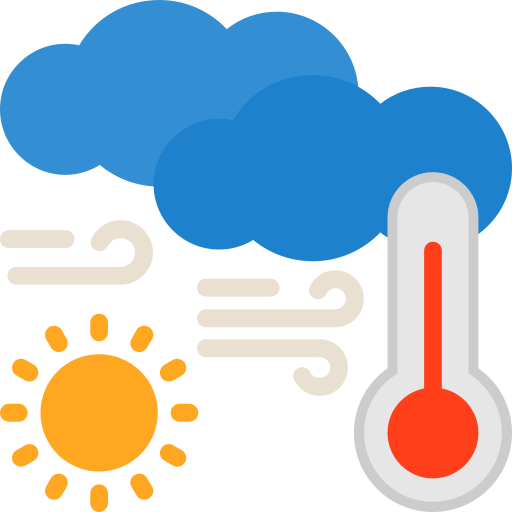

🚀 Live Demo
🌐 Visit Here:
# [Weather-App](https://weather-app-by-chkz.netlify.app)�
📌 Features
# 🌦️ Weather App

<p align="center">
  
</p>

<p align="center">
  
  
  
  
</p>

<p align="center">
  🌍 Real-Time Weather Application with Clean UI and Responsive Design
</p>

---

## ✨ Overview

The **Weather App** is a simple and responsive frontend project built using **HTML, CSS, and JavaScript**.  
This application allows users to search for any city and instantly view real-time weather information in a beautiful interface.

It is lightweight, beginner-friendly, and designed to improve frontend development skills while creating a useful real-world application.

---

# 🚀 Features

✅ Real-time weather updates  
✅ Search weather by city name  
✅ Responsive design for all devices  
✅ Clean and modern user interface  
✅ Dynamic weather information display  
✅ Fast and lightweight application  
✅ Beginner-friendly project structure  

---

# 🖥️ Technologies Used

| Technology | Purpose |
|------------|---------|
| HTML5 | Structure of the application |
| CSS3 | Styling and responsiveness |
| JavaScript | Functionality and dynamic updates |

---

# 📂 Project Structure

```bash
📦 Weather-App
 ┣ 📜 README.md
 ┣ 📜 index.html
 ┣ 📜 index.css
 ┣ 📜 index.js
 ┗ 🖼️ weather.png
```

---

# ⚙️ How It Works

1️⃣ User enters a city name  
2️⃣ JavaScript fetches weather data  
3️⃣ Weather information updates dynamically  
4️⃣ User gets instant weather details  

---

# 🌟 Why Use This Project?

### ⚡ Fast & Lightweight
The application is optimized for smooth and quick performance.

### 🎨 Clean UI
Simple and attractive interface for better user experience.

### 📱 Fully Responsive
Works perfectly on desktop, tablet, and mobile devices.

### 🧠 Beginner Friendly
Easy-to-understand code structure for learning frontend development.

### 🌍 Useful in Daily Life
Helps users quickly check weather conditions before planning activities.

---

# 💡 Use Cases

🌦️ Daily weather checking  
✈️ Travel planning  
🏫 Students checking weather before classes  
🚶 Outdoor activity planning  
📸 Helpful for travelers and vloggers  

---

# 📈 Advantages

✔️ Easy to customize  
✔️ Lightweight frontend project  
✔️ Improves JavaScript skills  
✔️ Great project for portfolio  
✔️ Real-world application practice  

---

# 🎨 Preview

<p align="center">
  
</p>

---

# 🛠️ Installation

Clone the repository:

```bash
git clone https://github.com/ChiranjithChkz/Weather-App.git
```

Open project folder:

```bash
cd weather-app
```

Run the project:

```bash
Open index.html in your browser
```

---

# 📚 Learning Outcomes

This project helps developers learn:

- DOM Manipulation
- API Integration
- Responsive Web Design
- Event Handling
- Frontend Development Basics

---

# 🔥 Future Improvements

- 🌙 Dark Mode
- 📍 Current Location Weather
- 📅 7-Day Forecast
- 🌐 Multi-language Support
- 🌩️ Weather Animations

---

# 🤝 Contribution

Contributions are welcome!

1. Fork the repository  
2. Create a new branch  
3. Commit your changes  
4. Push to the branch  
5. Open a Pull Request  

---

# ⭐ Support

If you like this project, give it a ⭐ on GitHub!

---

# 👨‍💻 Developer

Made  by **CHIRANJITH CHAKMA**

---

# 📜 License

This project can be used for educational purpose.

---

<p align="center">
  
✨ Keep Coding • Keep Learning • Keep Building ✨

</p>


 
